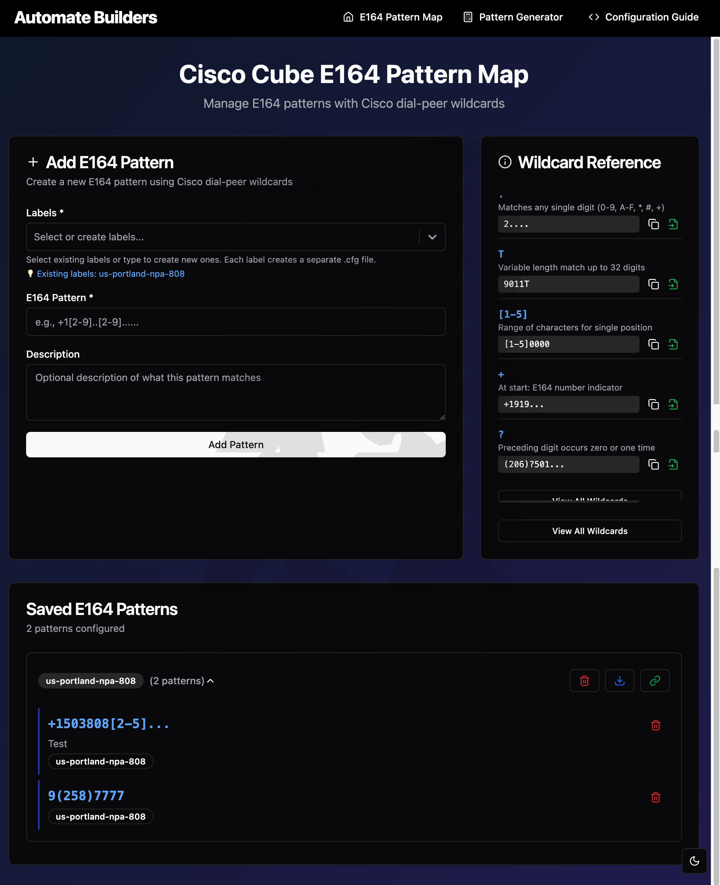
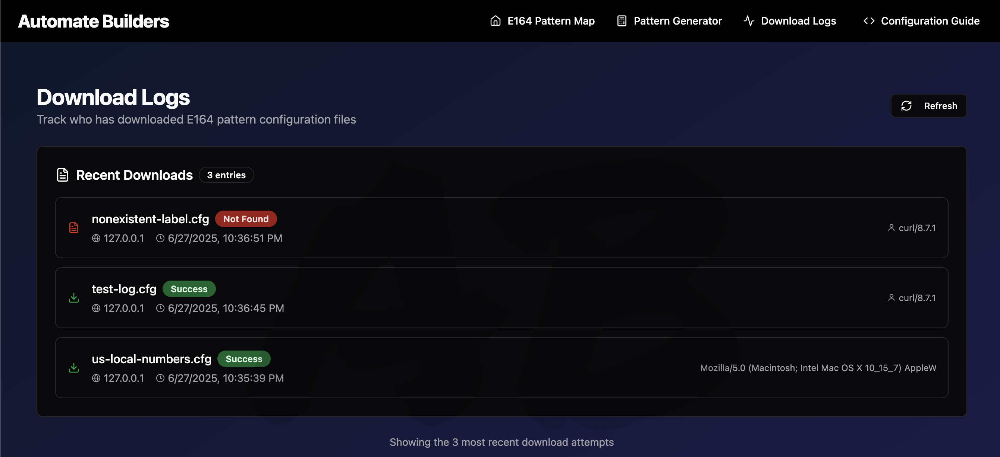

# Screenshots

This folder contains screenshots of the Cisco CUBE E164 Pattern Map application interface.

## Application Screenshots

### Home Page

The main dashboard where users can:
- Add new E164 patterns with labels and descriptions
- View, edit, and delete existing patterns
- Copy configuration file URLs
- Download .cfg files for Cisco router configuration

### Pattern Generator

Intelligent pattern generation tool that:
- Converts number ranges to optimized E164 patterns
- Processes bulk number lists with smart grouping
- Splits large ranges into efficient sub-patterns
- Provides multiple export options (copy, download, add to database)

### Configuration Guide

Built-in Cisco router configuration guide featuring:
- Dynamic host detection for personalized examples
- Customizable pattern map number input
- Copy-ready Cisco IOS commands
- Kron scheduler setup for automatic reloads
- Verification commands and example outputs

### Logging

Comprehensive logging system that tracks:
- Configuration file downloads with timestamps
- Pattern access and usage statistics
- System events and user activities
- Error tracking and debugging information

## Usage

These screenshots demonstrate the key features and user interface of the application. They can be used for:

- **Documentation** - Visual reference for features and functionality
- **Training** - Showing users how to navigate and use the application
- **Marketing** - Demonstrating capabilities to potential users
- **Support** - Helping users identify interface elements and workflows

## File Information

| Screenshot | Description | Key Features Shown |
|------------|-------------|-------------------|
| `Home.png` | Main dashboard | Pattern management, data table, form inputs |
| `Pattern Generator.png` | Pattern generation tool | Range conversion, bulk processing, export options |
| `Configuration Guide.png` | Cisco configuration help | Dynamic examples, copy commands, kron setup |
| `Logging.png` | Logging system | Download tracking, usage statistics, system events |

All screenshots show the application in light mode with the default "Automate Builders" branding. The interface supports both light and dark themes and custom branding options.